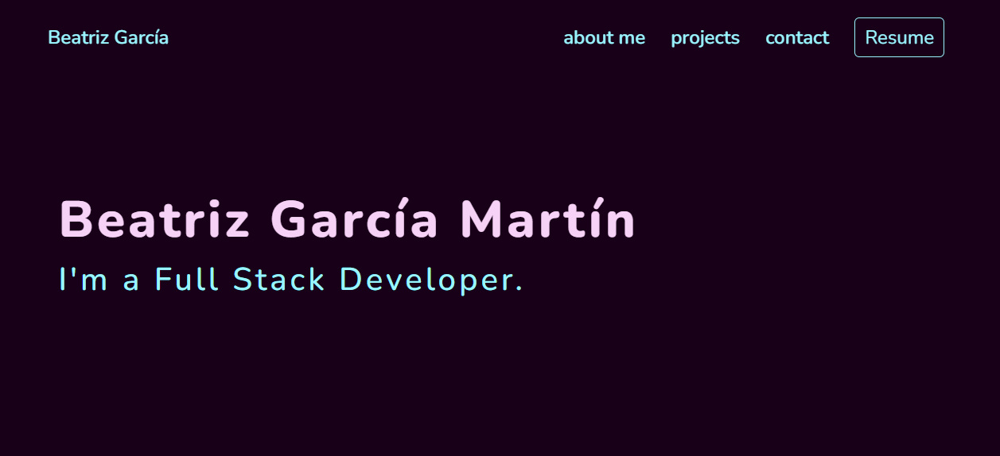

# Personal portfolio application
Version: 1.0.0
Author: Beatriz García
Author URI: https://github.com/TrizBea24

This is an exercise for General Assembly Web Development Course. This exercise is done with React, Bootstrap, HTML and Sass.

## Demo

To check the result of the web page's development, please check the next link: 
https://trizbea24.github.io/bgarcia-final/

## Development

### 1. Structure:

The application has a few components:

- A header with a button that opens a CV in pdf.
- A main section with hero, text about me and my projects.
- A contact section. 
- A copyright footer.

### 2. Projects:

- Each project has a link to its repository in Github and also to a demo page in case of frontend project.

## Application preview

## Install

To use this project you may need to follow the next steps:
- Clone the repo
- Install the dependencies with `npm install`
- Start the project with `npm start`

This project has been developed by **Beatriz García Martín**.
